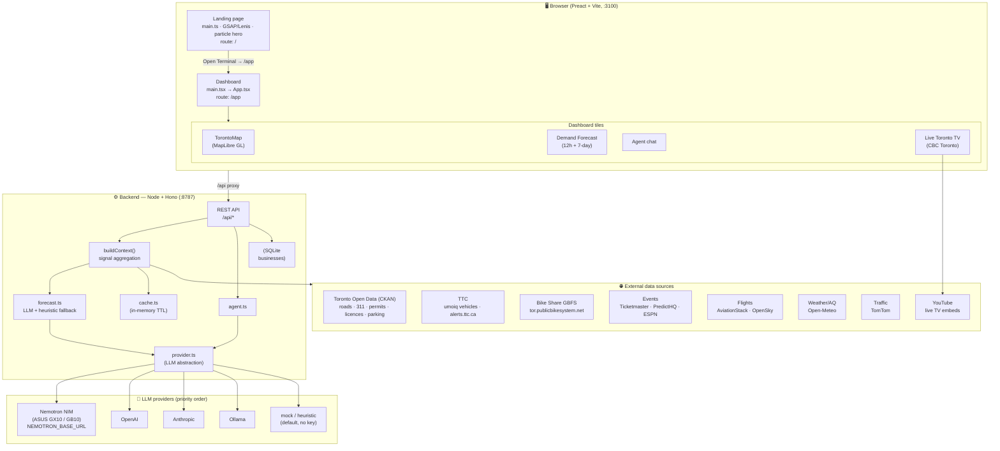
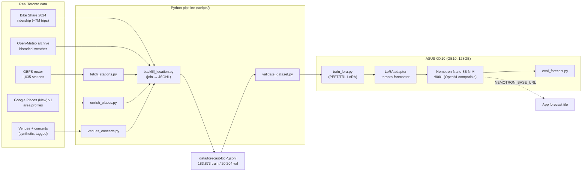
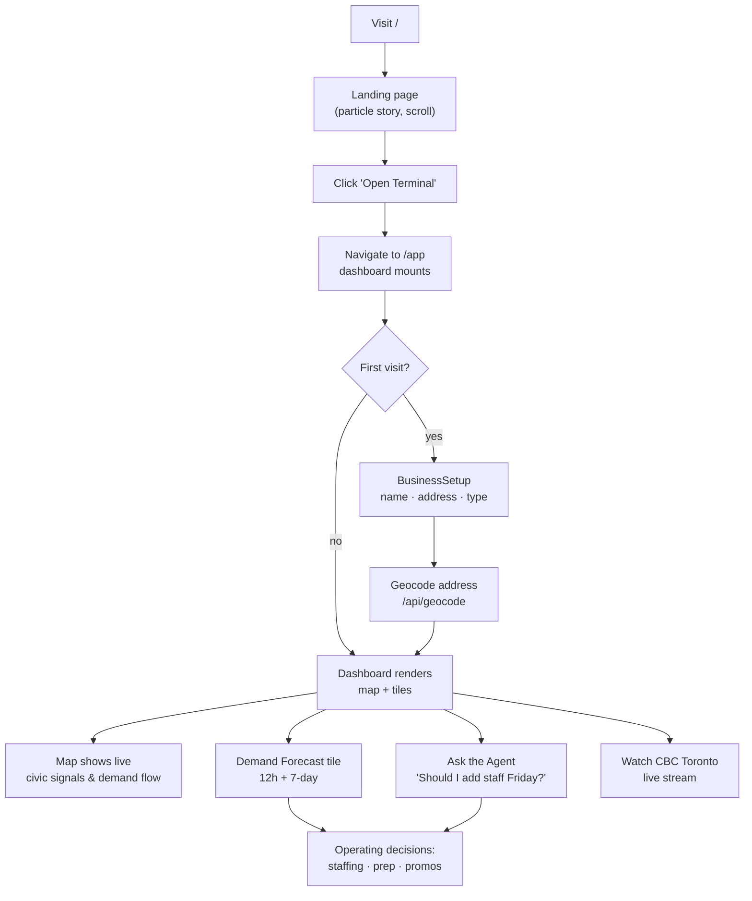
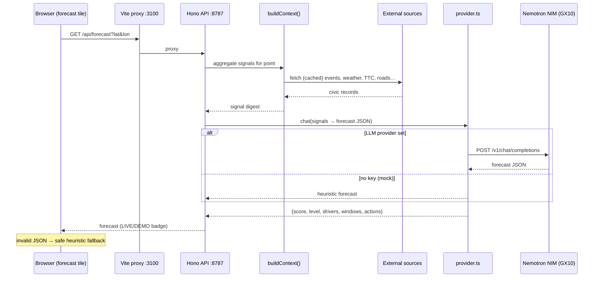
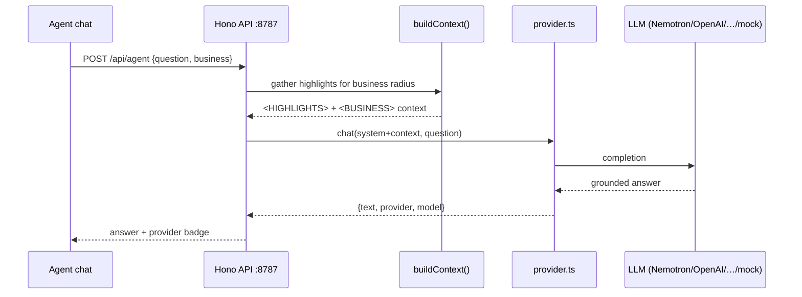

# CityFlow / Toronto Monitor — Architecture & User Flows

Small reference for how the system fits together. All diagrams are
[Mermaid](https://mermaid.js.org) and render directly on GitHub/GitLab.

---

## 1. Infrastructure / system architecture



---

## 2. Offline training loop (the GX10 "Toronto City Brain")

How real Toronto data becomes a fine-tuned forecaster that plugs back into the
app with zero code changes (see `docs/GX10-NEMOTRON.md`).



---

## 3. User flow — business owner using the dashboard



---

## 4. Sequence — a demand forecast request



---

## 5. Sequence — agent Q&A



---

## Provider selection (priority)

`activeProvider()` in `server/ai/provider.ts` picks the first env var present:

```
NEMOTRON_BASE_URL → OPENAI_API_KEY → ANTHROPIC_API_KEY → OLLAMA_HOST → mock
```

Everything works on **mock/heuristic** with no keys, so the app is always
demoable; pointing `NEMOTRON_BASE_URL` at the GX10 NIM upgrades the agent and
forecasts to on-device Nemotron with zero code changes.
